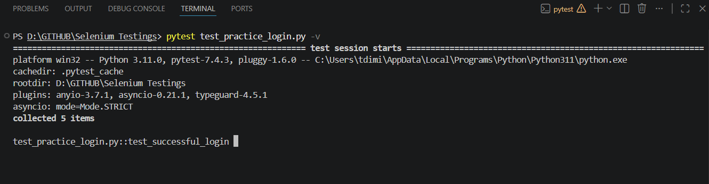
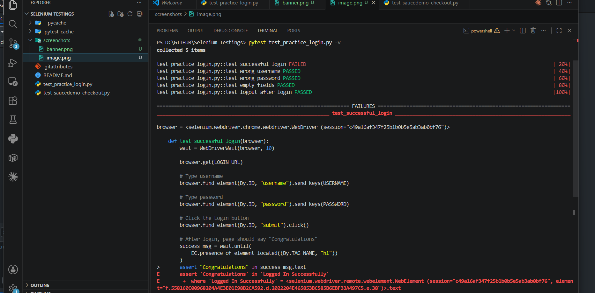

# 🧪 [Project Name] — Selenium Test Suite

> [One-line description — what application is being tested, what type of testing, and the framework used]


<!-- Tip: a screenshot of your Allure/Extent report dashboard works great here -->

[](YOUR_CI_PIPELINE_URL_HERE)
[](YOUR_GITHUB_REPO_URL_HERE)
[](YOUR_HOSTED_REPORT_URL_HERE)
<!-- Remove the Report badge if you don't host reports publicly -->

---

## 📌 Table of Contents

- [Overview](#overview)
- [Screenshots & Reports](#screenshots--reports)
- [Test Coverage](#test-coverage)
- [Tech Stack](#tech-stack)
- [Getting Started](#getting-started)
- [Configuration](#configuration)
- [Running Tests](#running-tests)
- [Project Structure](#project-structure)
- [Author](#author)

---

## 🧭 Overview

[Write 3–5 sentences here. What application are you testing? What type of tests does this suite cover — functional, regression, smoke, E2E? What testing approach or design pattern did you use (Page Object Model, Data-Driven, etc.)? Mention the browser(s) and any CI integration.]

**Application Under Test (AUT):** [https://your-app-under-test.com](https://your-app-under-test.com)  
**Test Report:** [https://your-hosted-report.com](https://your-hosted-report.com)  
**CI Pipeline:** [GitHub Actions / Jenkins / GitLab CI]

---

## 📸 Screenshots & Reports

### Test Execution Report

<!-- Screenshot of your Allure / Extent / TestNG HTML report summary -->

### Pass / Fail Summary


### Sample Test Run in Browser

<!-- Screenshot of Selenium driving the browser during a test -->

### Failed Test Evidence

<!-- Selenium auto-captures screenshots on failure — show one here -->

> 📁 Add all screenshots to a `/screenshots` folder in your repo root.  
> Configure your test suite to auto-capture browser screenshots on failure and save them here.

---

## ✅ Test Coverage

### Modules Covered

| Module               | Test Type         | No. of Cases | Status  |
|----------------------|-------------------|--------------|---------|
| [e.g. User Auth]     | Functional / E2E  | [00]         | ✅ Pass |
| [e.g. Registration]  | Functional        | [00]         | ✅ Pass |
| [e.g. Product Page]  | Regression        | [00]         | ✅ Pass |
| [e.g. Checkout Flow] | E2E               | [00]         | ✅ Pass |
| [e.g. Search]        | Functional        | [00]         | ✅ Pass |
| [e.g. Admin Panel]   | Smoke             | [00]         | ✅ Pass |
| **Total**            |                   | **[00]**     |         |

---

### Test Types Included

- [ ] Smoke Testing
- [ ] Functional Testing
- [ ] Regression Testing
- [ ] End-to-End (E2E) Testing
- [ ] Data-Driven Testing
- [ ] Cross-Browser Testing
- [ ] Negative / Boundary Testing

---

## 🛠️ Tech Stack

| Category          | Technology                                              |
|-------------------|---------------------------------------------------------|
| Language          | Java / Python / JavaScript / C#                         |
| Testing Framework | [TestNG / JUnit / pytest / Mocha]                       |
| Automation Tool   | Selenium WebDriver                                      |
| Browser Drivers   | ChromeDriver, GeckoDriver (Firefox), EdgeDriver         |
| Driver Management | [WebDriverManager / selenium-manager]                   |
| Design Pattern    | Page Object Model (POM)                                 |
| Reporting         | [Allure Reports / ExtentReports / TestNG HTML Report]   |
| Build Tool        | [Maven / Gradle / pip / npm]                            |
| CI/CD             | [GitHub Actions / Jenkins / GitLab CI]                  |
| IDE               | [IntelliJ IDEA / Eclipse / VS Code / PyCharm]           |
| Version Control   | Git, GitHub                                             |
| Other             | [e.g. Log4j, Apache POI for Excel, Faker for test data] |

---

## 🚦 Getting Started

### Prerequisites

Make sure you have the following installed:

- [Java JDK 11+](https://www.oracle.com/java/technologies/downloads/) *(skip if using Python/JS)*
- [Maven](https://maven.apache.org/) or [Gradle](https://gradle.org/) *(for Java projects)*
- [Python 3.8+](https://www.python.org/) *(skip if using Java)*
- [Node.js v18+](https://nodejs.org/) *(skip if using Java/Python)*
- [Google Chrome](https://www.google.com/chrome/) (latest)
- [Git](https://git-scm.com/)
- ChromeDriver matching your Chrome version *(or use WebDriverManager — auto-handled)*

---

### 1. Clone the Repository

```bash
git clone https://github.com/YOUR_USERNAME/YOUR_REPO_NAME.git
cd YOUR_REPO_NAME
```

---

### 2. Install Dependencies

**Java + Maven:**
```bash
mvn clean install -DskipTests
```

**Java + Gradle:**
```bash
gradle build -x test
```

**Python:**
```bash
pip install -r requirements.txt
```

**JavaScript (WebdriverIO / Nightwatch):**
```bash
npm install
```

---

### 3. Configure the Test Suite

Update `src/test/resources/config.properties` (or `config.json` / `.env`) with your settings:

```properties
# Application Under Test
base.url=https://your-app-under-test.com

# Browser settings
browser=chrome
headless=false

# Timeouts (in seconds)
implicit.wait=10
explicit.wait=15
page.load.timeout=30

# Test data
test.username=your_test_user@example.com
test.password=your_test_password
```

> ⚠️ Never commit real credentials. Use environment variables or a secrets manager in CI.

---

## ⚙️ Configuration

### Browser Options

The suite supports multiple browsers. Set `browser` in your config:

| Value     | Browser          |
|-----------|------------------|
| `chrome`  | Google Chrome    |
| `firefox` | Mozilla Firefox  |
| `edge`    | Microsoft Edge   |
| `safari`  | Safari (macOS only) |

### Headless Mode

Set `headless=true` in config to run without a visible browser window — useful for CI pipelines.

### Test Data

- Static test data: `src/test/resources/testdata/[filename].xlsx` or `.csv`
- Dynamic data: generated with [Faker / JavaFaker] *(if used)*

---

## ▶️ Running Tests

### Run All Tests

**Maven:**
```bash
mvn test
```

**Gradle:**
```bash
gradle test
```

**Python (pytest):**
```bash
pytest tests/ -v
```

**JavaScript:**
```bash
npm test
```

---

### Run a Specific Test Class

**Maven:**
```bash
mvn test -Dtest=LoginTest
```

**pytest:**
```bash
pytest tests/test_login.py -v
```

---

### Run by Tag / Group

**TestNG (by group):**
```bash
mvn test -Dgroups=smoke
```

**pytest (by marker):**
```bash
pytest -m smoke -v
```

---

### Run in Headless Mode

**Maven:**
```bash
mvn test -Dheadless=true
```

**pytest:**
```bash
pytest --headless=true
```

---

### Generate Test Report

**Allure (after test run):**
```bash
allure serve target/allure-results
# or generate static report:
allure generate target/allure-results -o allure-report --clean
```

**ExtentReports:** Report auto-generates at `test-output/ExtentReport.html` after the run.

---

## 📁 Project Structure

```
root/
├── src/
│   ├── main/java/
│   │   └── [com.yourproject]/
│   │       ├── pages/              # Page Object classes (POM)
│   │       │   ├── BasePage.java
│   │       │   ├── LoginPage.java
│   │       │   └── [FeaturePage].java
│   │       ├── utils/              # Helper utilities
│   │       │   ├── DriverManager.java
│   │       │   ├── ConfigReader.java
│   │       │   └── ScreenshotUtil.java
│   │       └── constants/          # Locators, URLs, constants
│   │
│   └── test/
│       ├── java/[com.yourproject]/
│       │   ├── base/
│       │   │   └── BaseTest.java   # Setup / teardown logic
│       │   └── tests/
│       │       ├── LoginTest.java
│       │       └── [Feature]Test.java
│       └── resources/
│           ├── config.properties   # Test configuration
│           ├── testng.xml          # TestNG suite definition
│           └── testdata/
│               └── [data].xlsx     # External test data
│
├── screenshots/                    # README screenshots
│   ├── report-banner.png
│   ├── report-overview.png
│   ├── pass-fail-chart.png
│   ├── browser-execution.png
│   └── failed-test.png
│
├── test-output/                    # Auto-generated reports (gitignored)
├── allure-results/                 # Allure raw data (gitignored)
├── pom.xml                         # Maven config (or build.gradle)
├── .gitignore
└── README.md
```

> **Note:** Adjust the structure above to match your actual language and build tool. Python projects use `tests/`, `pages/`, `utils/` at the root level. JS projects follow a similar flat structure.

---

### Page Object Model (POM) Example

Each page of the AUT has a dedicated class that encapsulates its locators and actions:

```java
// LoginPage.java
public class LoginPage extends BasePage {
    // Locators
    private By emailField = By.id("email");
    private By passwordField = By.id("password");
    private By loginButton = By.cssSelector("button[type='submit']");

    // Actions
    public void enterEmail(String email) { driver.findElement(emailField).sendKeys(email); }
    public void enterPassword(String password) { driver.findElement(passwordField).sendKeys(password); }
    public void clickLogin() { driver.findElement(loginButton).click(); }
    public void login(String email, String password) {
        enterEmail(email);
        enterPassword(password);
        clickLogin();
    }
}
```

---

## 👨‍💻 Author

**Thisal Gonsalkorala**  
Full-Stack Software Engineer

[](YOUR_PORTFOLIO_URL)
[](YOUR_LINKEDIN_URL)
[](https://github.com/YOUR_USERNAME)
[](mailto:tdimith10@gmail.com)

---

## 📄 License

This project is licensed under the [MIT License](./LICENSE).

---

> Tests don't slow you down — they give you the confidence to move fast. — Thisal Gonsalkorala
